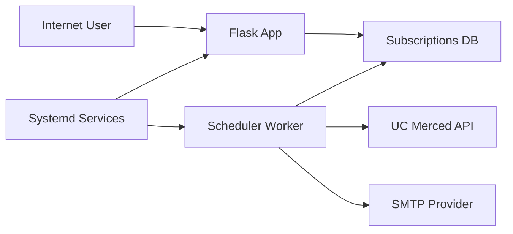

## Executive summary
SeatSeeker is currently optimized for anonymous public access and fast deployment, which makes availability abuse and privacy leakage the top risks. The highest-priority issues are public exposure of all subscriber emails via `GET /api/subscriptions`, anonymous unsubscribe/delete abuse, and SMTP quota exhaustion from automated subscription spam. Existing controls (input validation, per-route limits, systemd restart) reduce casual abuse, but stronger anti-automation and data-minimization controls are needed for safe public operation over the next 2 to 3 months.

## Scope and assumptions
- In-scope paths:
  - `main/app.py`
  - `main/checker_service.py`
  - `main/db.py`
  - `main/run.py`
  - `main/gunicorn.conf.py`
  - `deploy/systemd/seatseeker-dashboard.service`
  - `deploy/systemd/seatseeker-scheduler.service`
  - `main/templates/index.html`
- Out-of-scope:
  - AWS account/org-level IAM controls not in repo
  - TLS termination config (Nginx/ALB not represented in code)
  - Third-party provider internals (Gmail SMTP backend)
- Confirmed assumptions from user:
  - Public anonymous usage is intended for ~2 to 3 months.
  - Delete by `email + crn` is acceptable for now.
  - Single-instance operation is currently acceptable unless load requires scaling.
- Open questions that could materially change ranking:
  - Whether `/api/subscriptions` GET must remain publicly readable long term.
  - Whether CAPTCHA or proof-of-email can be added during the semester.
  - Whether frontend will stay direct-to-app or move behind reverse proxy/WAF.

## System model
### Primary components
- Public Flask API and dashboard in `main/app.py` (`/`, `/api/health`, `/api/metrics`, `/api/subscriptions` CRUD).
- Background scheduler/notification worker in `main/checker_service.py` (`check_availability`, `send_email_notification`).
- Data layer in `main/db.py` (SQLite or Postgres via `DATABASE_URL`).
- Runtime launcher in `main/run.py`; production process wrappers in `deploy/systemd/*.service`.
- SMTP dependency via `smtplib.SMTP_SSL` in `main/checker_service.py`.

### Data flows and trust boundaries
- Internet user -> Flask API (`/api/subscriptions` POST/DELETE/GET).
  - Data types: email addresses, CRNs, request metadata.
  - Protocol: HTTP.
  - Security guarantees: route-level rate limiting and payload checks in `main/app.py`.
  - Validation: email regex, CRN regex, max CRNs/email, max request size.
- Flask API -> Database (`subscriptions`, `priority_holds`).
  - Data types: subscriber PII (email), CRN subscriptions, status timestamps.
  - Channel: SQLite file or Postgres connection from `main/db.py`.
  - Security guarantees: parameterized SQL in app/worker code.
  - Validation: app-side normalization and dedupe logic.
- Scheduler -> UC Merced registration API.
  - Data types: course availability snapshots.
  - Protocol: outbound HTTPS via `ClassChecker.run()`.
  - Security guarantees: timeout control and exception handling.
- Scheduler -> SMTP provider.
  - Data types: notification email content, recipient addresses, SMTP credentials.
  - Protocol: SMTP over SSL (`SMTP_SSL`).
  - Security guarantees: TLS transport; no in-repo key management beyond `.env`.

#### Diagram

## Assets and security objectives
| Asset | Why it matters | Security objective (C/I/A) |
|---|---|---|
| Subscriber email addresses | PII exposure and abuse/spam risk | C, I |
| Subscription state (`email`, `crn`, status) | Drives who gets notifications; tampering causes user harm | I, A |
| SMTP credentials in `.env` | Credential theft enables spam/lockout/account abuse | C, I |
| SMTP daily quota/provider reputation | Exhaustion blocks all notifications | A |
| EC2 compute/network budget | Abuse can create unexpected cost/outage | A |
| Scheduler process continuity | If down, alerts stop | A |
| Operational logs (`journalctl`) | Required for abuse detection and incident response | I, A |

## Attacker model
### Capabilities
- Anonymous internet client can call public endpoints repeatedly.
- Can automate high-volume requests from one or many IPs.
- Can guess or know victim email and CRN values (CRNs are public course identifiers).
- Can attempt economic abuse (quota burn, CPU/network pressure).

### Non-capabilities
- No assumed shell/host access to EC2.
- No assumed database credentials unless separately compromised.
- No assumed control of UC Merced API or Gmail SMTP infrastructure.
- No assumed privileged app account, because no auth model exists today.

## Entry points and attack surfaces
| Surface | How reached | Trust boundary | Notes | Evidence (repo path / symbol) |
|---|---|---|---|---|
| `GET /` | Public browser | Internet -> Flask | Dashboard UI | `main/app.py:home` |
| `GET /api/subscriptions` | Public HTTP | Internet -> Flask -> DB | Returns grouped subscriber data by email | `main/app.py:get_subscriptions` |
| `POST /api/subscriptions` | Public HTTP | Internet -> Flask -> DB | Inserts subscriptions; rate-limited | `main/app.py:create_subscription` |
| `DELETE /api/subscriptions` | Public HTTP | Internet -> Flask -> DB | Deletes by `email+crn`; no ownership proof | `main/app.py:delete_subscription` |
| `GET /api/health` | Public HTTP | Internet -> Flask -> DB | Health metadata, sanitized errors by default | `main/app.py:health` |
| `GET /api/metrics` | Public HTTP | Internet -> Flask -> DB | Aggregate metrics; no auth | `main/app.py:metrics` |
| Scheduler loop | systemd process | Host runtime -> DB/UCM/SMTP | Continuous worker with retries | `main/checker_service.py:main` |
| SMTP send path | worker runtime | Worker -> SMTP | Uses `.env` credentials | `main/checker_service.py:send_email_notification` |
| Environment file loading | startup | Host filesystem -> app/worker | Secret material in `.env` | `main/db.py` and `main/checker_service.py` load_dotenv |

## Top abuse paths
1. Attacker mass-submits fake subscriptions -> consumes DB rows and scheduler work -> burns SMTP quota when courses open -> legitimate users miss alerts.
2. Attacker calls `GET /api/subscriptions` -> harvests subscriber emails -> targeted spam/phishing against students.
3. Attacker guesses victim email + known CRN -> calls `DELETE /api/subscriptions` -> silently unsubscribes victim from alerts.
4. Botnet distributes requests across many IPs -> bypasses per-IP limits -> sustained API and worker pressure.
5. Attacker repeatedly queues high-interest CRNs -> synchronized notification spikes -> Gmail throttles or blocks sender.
6. Misconfigured host exposes `.env` via backup/logging mistake -> SMTP credential compromise -> external spam and account lock.
7. Scheduler crashes repeatedly from external dependency errors -> no notifications while dashboard appears healthy.

## Threat model table
| Threat ID | Threat source | Prerequisites | Threat action | Impact | Impacted assets | Existing controls (evidence) | Gaps | Recommended mitigations | Detection ideas | Likelihood | Impact severity | Priority |
|---|---|---|---|---|---|---|---|---|---|---|---|---|
| TM-001 | Anonymous internet attacker | Public endpoint access | Automates `POST /api/subscriptions` to flood queues | SMTP quota exhaustion, DB growth, degraded service | SMTP quota, DB availability, EC2 budget | Per-route and global limits in `main/app.py` (`Limiter`, `SUBSCRIPTION_POST_RATE`), input caps | In-memory limiter not resilient to multi-instance or distributed-IP abuse | Add CAPTCHA/hCaptcha on submit, IP+email reputation checks, Redis-backed limiter, per-email/day cap | 429 rate logs, DB row growth alarms, SMTP failure rate alarms | High | High | high |
| TM-002 | Anonymous attacker | Knows/guesses target email+CRN | Calls `DELETE /api/subscriptions` for victim | Unauthorized unsubscribe (integrity loss) | Subscription integrity, user trust | Delete endpoint exists with rate limit | No ownership verification or auth check on delete | Add signed unsubscribe token via email link; require token for deletion | Audit delete attempts by IP/email/CRN; alert on delete spikes | High | Medium | high |
| TM-003 | Anonymous attacker | Public read access | Calls `GET /api/subscriptions` to harvest emails | PII leak and downstream phishing/spam | Subscriber emails, trust/compliance | None specific beyond API implementation | Endpoint exposes full grouped emails publicly | Remove/lock endpoint from public internet, return redacted/admin-only data, or require admin auth | Access logs for read volume and unusual client patterns | High | High | high |
| TM-004 | External spammer/economic attacker | Course open events + many recipients | Triggers send bursts at open times | Provider throttling/blocks; delayed or failed alerts | Notification availability | FIFO mode and batch settings exist in scheduler env (`NOTIFY_MODE`, `NOTIFY_BATCH_SIZE`) | Default may still over-send under spikes; no provider-aware backoff budget | Enforce strict per-cycle send cap, queue with retries/jitter, migrate to SES/transactional provider | Track send_success/send_fail ratios, quota alarms | Medium | High | high |
| TM-005 | Botnet | Multiple source IPs | Evades per-IP limits and sends distributed traffic | Resource pressure and higher cost | EC2/network budget, app availability | Flask-Limiter + max payload size (`MAX_CONTENT_LENGTH`) | No upstream WAF/CDN shield, no bot management | Add reverse proxy/WAF rate controls, geo/IP reputation filtering, fail2ban style bans | NetworkOut/CPU alarms + 4xx/5xx anomaly alerts | Medium | Medium | medium |
| TM-006 | Insider/misconfig leakage | Host or backup/log access | Exposes `.env` SMTP credentials | Account abuse and service hijack | SMTP credentials, sender reputation | `.env` intended local and ignored in git (`SECURITY.md`, config docs) | No secret manager integration; credential rotation process not enforced in code | Move secrets to AWS SSM/Secrets Manager, periodic credential rotation, least-privileged mail account | Alert on auth failures/sudden send volume from provider | Medium | High | high |
| TM-007 | Anonymous observer | Public health endpoint | Polls operational metadata | Minor recon for timing and state | Operational secrecy | Health returns sanitized errors by default (`EXPOSE_INTERNAL_ERRORS`) | Endpoint still reveals uptime/service identity | Keep sanitized output; optional auth/IP restriction in prod | Track health endpoint scrape frequency | Medium | Low | low |
| TM-008 | External dependency failure exploited by timing | UC API/SMTP instability | Causes repeated worker exceptions and retries | Notification delay/outage | Service availability | Retry loop and systemd restart (`main/checker_service.py`, `deploy/systemd/*`) | No explicit liveness SLO alarm for stale `last_checked` | Alert if scheduler stale > threshold; health metric for worker freshness | Alarm on stale `last_checked` and repeated exceptions | Medium | Medium | medium |

## Criticality calibration
- `critical`: Direct compromise with severe impact and no practical containment.
  - Example for this repo: mass credential theft plus account takeover of SMTP sender causing persistent malicious mailing and lockout.
  - Example: unauthenticated remote code execution in web or scheduler path.
- `high`: High-likelihood abuse that materially harms users/availability/privacy.
  - Public email enumeration via `GET /api/subscriptions`.
  - Unauthorized delete/unsubscribe by guessing `email+crn`.
  - Subscription spam causing quota exhaustion.
- `medium`: Exploitable weaknesses with constrained blast radius or mitigations.
  - Distributed rate-limit bypass without full outage.
  - Scheduler stale/outage detectable with monitoring.
  - Recon-level operational leakage from public health/metrics.
- `low`: Limited impact, noisy, or hard-to-exploit issues.
  - Service fingerprinting via non-sensitive headers.
  - Public metadata that does not include secrets/PII.

## Focus paths for security review
| Path | Why it matters | Related Threat IDs |
|---|---|---|
| `main/app.py` | Public API entrypoints, validation, PII exposure, delete semantics, limiter controls | TM-001, TM-002, TM-003, TM-005, TM-007 |
| `main/checker_service.py` | SMTP auth/send path, queue logic, retry behavior, quota exhaustion risk | TM-004, TM-006, TM-008 |
| `main/db.py` | Secret loading, DB backend switching, schema initialization | TM-006 |
| `main/templates/index.html` | Client-side API usage patterns and potential abuse facilitation | TM-001, TM-002, TM-003 |
| `deploy/systemd/seatseeker-dashboard.service` | Runtime resilience and process security assumptions | TM-008 |
| `deploy/systemd/seatseeker-scheduler.service` | Worker uptime and failure-recovery behavior | TM-008 |
| `main/config.env` | Security-sensitive runtime controls and defaults | TM-001, TM-004, TM-006 |
| `docs/OPERATIONS.md` | Operational controls, alarms, incident readiness | TM-004, TM-005, TM-008 |

## Quality check
- Entry points covered: Yes (`/`, `/api/health`, `/api/metrics`, `/api/subscriptions` GET/POST/DELETE, scheduler loop, SMTP send path).
- Trust boundaries represented in threats: Yes (Internet->API, API->DB, worker->SMTP, worker->external API, host runtime boundaries).
- Runtime vs CI/dev separation: Yes (model focuses on runtime services and host deployment; CI/build not treated as core risk path here).
- User clarifications reflected: Yes (anonymous usage accepted, delete-by-email+CRN accepted short term, single-instance current model).
- Assumptions and open questions explicit: Yes (scope and assumptions section).
